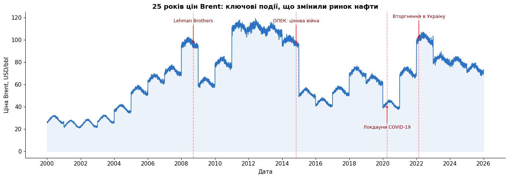

# 🛢️ Petrodollar System Analysis (2000–2025)

> Як рухається ціна нафти, хто на ній заробляє, і чи витісняє юань долар у глобальній торгівлі

[](https://colab.research.google.com/github/aluhanska/Petrodollar_System_Analysis_2000-2025/blob/main/notebook.ipynb)

---

## 📌 Про проєкт

Аналіз петродоларової системи за **25 років** на основі 5 взаємопов'язаних таблиць
(~13 000 записів, 25 країн). Перевіряємо, чи ОПЕК ще керує ринком, як сланцева
революція США змінила баланс сил, і чи реально світ дедоларизується.

**Інструменти:** Python (pandas · numpy · matplotlib · seaborn · scipy) + SQL (BigQuery)

---

## 🔑 Ключові висновки

1. **Кореляція дотримання квот ОПЕК і ціни Brent = 0.06** (p > 0.05) — картель уже не контролює ринок
2. **Долар і нафта обернено пов'язані** (r = -0.45, p < 0.001) — DXY залишається важливим макроіндикатором
3. **Дедоларизація реальна, але повільна**: USD у резервах впав з 66.5% до 56.8% за 25 років
4. **Росія заробила +$66 млрд у 2022** попри санкції — за рахунок продажів Китаю та Індії
5. **Петроюань зростає на 59% щороку** з 2018, але абсолютні обсяги ще малі

---

## 📊 Ключова візуалізація



*25 років цін Brent з ключовими подіями: Lehman Brothers (2008), цінова війна ОПЕК (2014), COVID (2020), вторгнення в Україну (2022).*

---

## 📂 Структура репозиторію

```
├── notebook.ipynb        # Основний аналіз: 10 бізнес-питань
├── data/                 # CSV-файли датасету
└── images/               # Прев'ю графіка для README
```

---

## ❓ 10 бізнес-питань

| # | Питання | Метод |
|---|---------|-------|
| 1 | Чи ОПЕК контролює ціну нафти через квоти? | Кореляція Пірсона |
| 2 | Як сланцева революція США змінила баланс? | SQL CTE + Window Function |
| 3 | Які роки найволатильніші? | CV-аналіз |
| 4 | Чи DXY обернено пов'язаний з Brent? | Кореляція + t-test |
| 5 | Хто виграв від суперциклу 2021–2022? | SQL PIVOT |
| 6 | Як суверенні фонди залежать від нафти? | Кореляція по фондах |
| 7 | Як швидко зростає петроюань? | CAGR + JOIN |
| 8 | Чи скорочується USD у резервах? | Тренд-аналіз |
| 9 | Чи кризові роки відрізняються? | t-test |
| 10 | Чи ОПЕК заробляє більше за барель? | t-test + Window Function |

---

## 📋 Дані

- **Джерело:** [Global Petrodollars & De-dollarization Trends (Kaggle)](https://www.kaggle.com/datasets/moaz1911/global-petrodollars-and-de-dollarization-trends/data)
- **Період:** 2000–2025
- **Структура:** 5 таблиць (виробництво, ОПЕК, суверенні фонди, дедоларизація, ціни)

---

## 🚀 Як запустити

**Найпростіше — через Colab:** натисни бейдж «Open in Colab» зверху.

**Локально:**
```bash
git clone https://github.com/aluhanska/Petrodollar_System_Analysis_2000-2025.git
cd Petrodollar_System_Analysis_2000-2025
pip install pandas matplotlib seaborn scipy google-cloud-bigquery
jupyter notebook notebook.ipynb
```

---

## 👤 Автор

**Анна Денисенко** — аналітик даних
